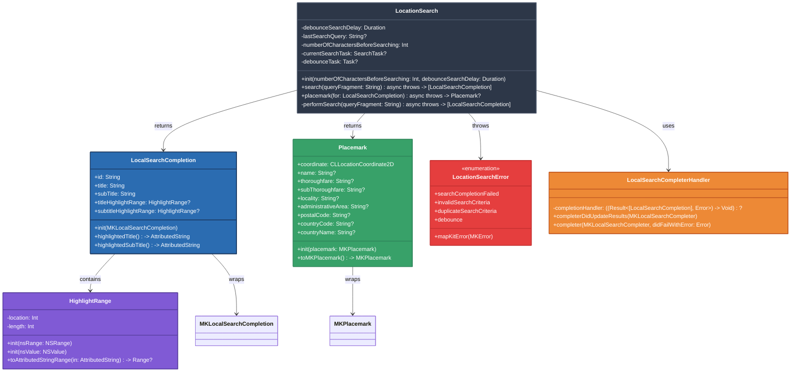
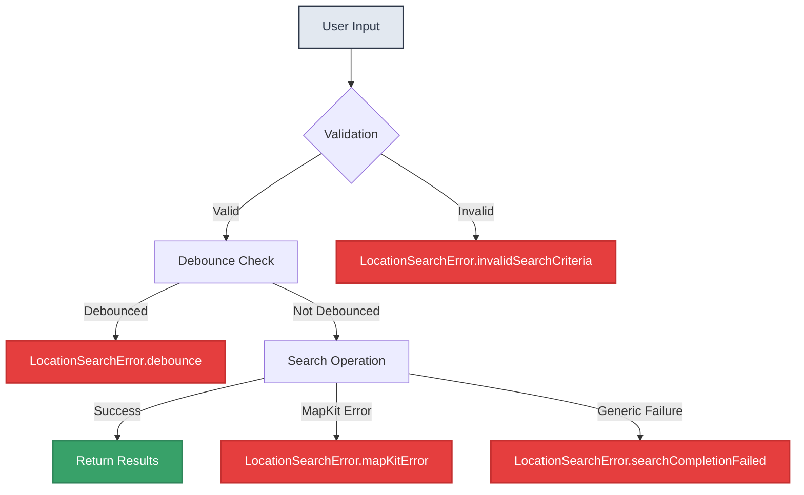
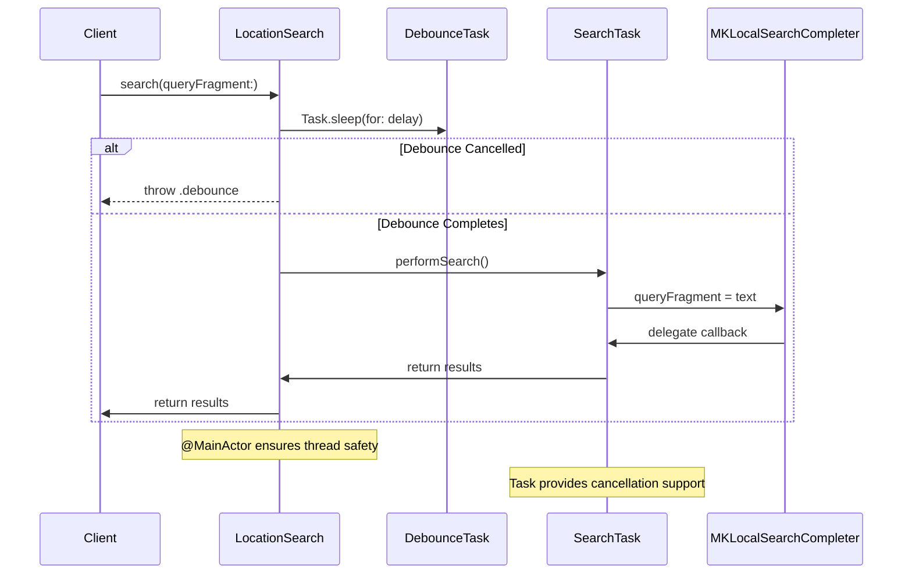

# MapKitSwiftSearch Architecture

## Overview

MapKitSwiftSearch is a modern Swift package that provides a clean, concurrent-friendly interface for location search operations using MapKit. The package wraps Apple's `MKLocalSearchCompleter` and related APIs to provide a more Swift-idiomatic experience with structured concurrency, type safety, and cross-platform compatibility.

## Design Philosophy

The architecture follows the principles outlined in "A Philosophy of Software Design" by John Ousterhout, emphasizing:

- **Deep Modules**: Each component provides significant functionality while maintaining simple interfaces
- **Information Hiding**: Internal implementation details are encapsulated, exposing only essential APIs
- **Layer Separation**: Clear boundaries between data models, search logic, and platform-specific UI concerns
- **Consistent Abstractions**: Similar operations use consistent patterns throughout the API

## Core Components

### Primary Classes and Structures



## Key Architectural Decisions

### 1. MainActor Attribution on LocationSearch

**Decision**: The `LocationSearch` class is marked with `@MainActor`.

**Rationale**: 
- MapKit's `MKLocalSearchCompleter` requires main thread interaction
- Ensures thread safety by eliminating race conditions on shared state
- Provides clear concurrency semantics for callers
- Simplifies the API by removing the need for manual thread management

**Trade-offs**:
- Slightly less flexible for background processing scenarios
- All search operations must be called from the main actor context
- Balanced against the complexity reduction and safety guarantees

### 2. Task-Based Cancellation Strategy

**Decision**: Each search operation creates a new `Task` that can be cancelled independently.

**Rationale**:
- Prevents resource waste when users type quickly and cancel previous searches
- Provides clean cancellation semantics with Swift's structured concurrency
- Eliminates callback-based complexity from the MapKit delegate pattern
- Enables proper error handling for cancelled operations

**Implementation Details**:
```swift
currentSearchTask?.cancel()
let task = SearchTask {
    try await performSearch(queryFragment: queryFragment)
}
currentSearchTask = task
```

### 3. New MKLocalSearchCompleter Per Search

**Decision**: A fresh `MKLocalSearchCompleter` instance is created for each search operation.

**Rationale**:
- **Continuation Safety**: Avoids potential conflicts when multiple async/await continuations might be waiting on the same delegate
- **Clean State**: Each search starts with a clean slate, preventing state pollution from previous searches
- **Simplified Error Handling**: Eliminates complex state management around delegate callbacks
- **Cancellation Clarity**: When a search is cancelled, the entire completer instance is discarded

**Alternative Considered**: Reusing a single completer instance was considered but rejected due to the complexity of managing multiple concurrent continuations and ensuring proper cleanup.

### 4. Debouncing Strategy

**Decision**: Implement debouncing at the API level using Swift's `Task.sleep`.

**Rationale**:
- Reduces unnecessary API calls when users are actively typing
- Provides a responsive feel while preventing API abuse
- Uses structured concurrency for clean timeout management
- Configurable delay allows customization for different use cases

**Implementation**:
```swift
debounceTask = Task {
    try await Task.sleep(for: debounceSearchDelay)
    return true
}
guard await debounceTask.value else {
    throw LocationSearchError.debounce
}
```

### 5. Sendable-Compliant Data Models

**Decision**: All public data types (`LocalSearchCompletion`, `Placemark`, `HighlightRange`) conform to `Sendable`.

**Rationale**:
- Enables safe passage between actor contexts
- Future-proofs the API for Swift's strict concurrency model
- Provides compile-time guarantees about thread safety
- Simplifies client code by eliminating manual synchronization needs

### 6. Platform-Specific Extensions for UI Highlighting

**Decision**: Separate platform-specific extensions for iOS (`UIColor`) and macOS (`NSColor`) highlighting functionality.

**Rationale**:
- **Single Responsibility**: Core data models remain platform-agnostic
- **Type Safety**: Uses appropriate platform color types without abstraction
- **Performance**: No runtime platform checks or unnecessary abstractions
- **Maintainability**: Platform-specific UI code is isolated and clearly marked

**File Structure**:
```
PlatformSpecific/
├── LocalSearchCompletion+iOS.swift     // UIColor-based highlighting
└── LocalSearchCompletion+macOS.swift   // NSColor-based highlighting
```

### 7. Private HighlightRange Properties

**Decision**: The `location` and `length` properties of `HighlightRange` are private.

**Rationale**:
- **Information Hiding**: Clients don't need to know about NSRange internals
- **API Stability**: Internal representation can change without breaking client code  
- **Focused Interface**: Only the essential `toAttributedStringRange` method is exposed
- **Error Prevention**: Prevents clients from manually manipulating range values incorrectly

### 8. Extracted Search Logic

**Decision**: The core search logic is extracted into a private `performSearch` method.

**Rationale**:
- **Separation of Concerns**: Validation, debouncing, and caching are separated from the actual search
- **Testability**: Core search logic can be tested independently
- **Readability**: The public `search` method clearly shows the flow without implementation details
- **Maintainability**: Changes to search logic don't affect validation and error handling code

## Error Handling Strategy

The package uses a comprehensive error handling approach:



### Error Categories

1. **User Input Errors**: Invalid or insufficient search criteria
2. **Operational Errors**: Debouncing and duplicate request prevention  
3. **System Errors**: MapKit failures and network issues
4. **Logic Errors**: Unexpected states in search completion

## Concurrency Model

The package leverages Swift's structured concurrency throughout:



## Memory Management

The architecture carefully manages memory and resources:

1. **Automatic Cleanup**: Tasks are automatically cleaned up when cancelled or completed
2. **Weak References**: Delegate patterns use appropriate memory management
3. **Resource Disposal**: Search completers are discarded after each operation
4. **State Isolation**: Minimal shared state reduces memory retention issues

## Future Extensibility

The architecture supports future enhancements:

1. **Region-Based Search**: The `Placemark` structure can easily accommodate region filtering
2. **Custom Search Types**: The error handling system can be extended for new search categories
3. **Caching Layer**: The extracted search logic provides a clear insertion point for caching
4. **Analytics Integration**: The logging infrastructure can be extended for metrics collection

## Testing Architecture

The design facilitates comprehensive testing:

1. **Dependency Injection**: Core components can be mocked for unit testing
2. **Error Simulation**: The error handling system supports comprehensive error scenario testing
3. **Concurrency Testing**: Task-based operations can be tested for proper cancellation behavior
4. **Platform Testing**: Platform-specific code is isolated for targeted testing

This architecture provides a solid foundation for reliable, performant location search functionality while maintaining clean separation of concerns and excellent testability.