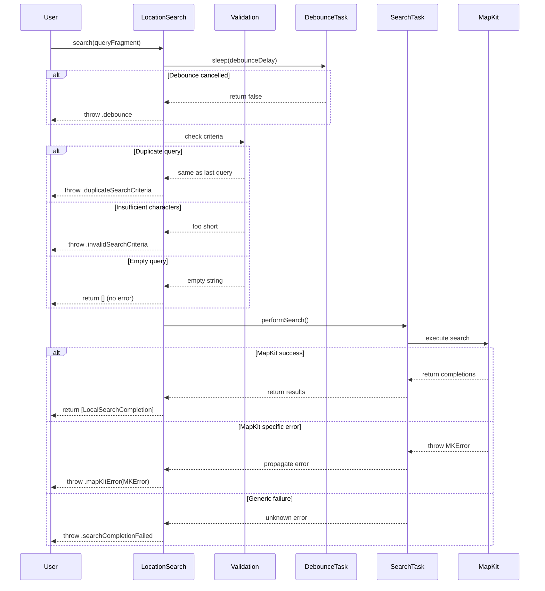

# Search Flow Sequence Diagrams

## Overview

This document contains sequence diagrams that illustrate the flow of operations within MapKitSwiftSearch for key user interactions. These diagrams help understand the timing, actor interactions, and error handling patterns in the system.

## Primary Search Flow

The following diagram shows the complete flow from user input to search results, including debouncing, validation, and MapKit interaction.

## Placemark Retrieval Flow

This diagram shows the process of converting a search completion result into detailed placemark information.

## Concurrent Search Cancellation

This diagram illustrates how the system handles multiple concurrent search requests and proper cancellation behavior.

## Error Handling Flow

This diagram shows the comprehensive error handling throughout the search process.

## Highlight Range Processing

This diagram shows how highlight ranges are processed from MapKit through to UI display.

## Key Design Insights

### Cancellation Strategy
- **New Completer Per Search**: Avoids complex state management and continuation conflicts
- **Task-Based Cancellation**: Clean cancellation semantics using Swift's structured concurrency
- **Resource Cleanup**: Cancelled completers are automatically disposed

### Error Isolation
- **Layered Validation**: Multiple validation points prevent invalid requests from reaching MapKit
- **Specific Error Types**: Different error cases enable appropriate user experience responses
- **Graceful Degradation**: System continues operating even when individual searches fail

### Thread Safety
- **MainActor Isolation**: All LocationSearch operations are main-actor bound
- **Task Encapsulation**: Each search runs in its own task context
- **Immutable Results**: Search results are immutable and Sendable

### Performance Optimization
- **Debouncing**: Prevents excessive API calls during rapid user input
- **Early Termination**: Validation checks prevent unnecessary network requests
- **Memory Efficiency**: Fresh completers prevent memory accumulation from long-running searches

These sequence diagrams provide a comprehensive view of the system's behavior under various conditions, helping developers understand not just what happens, but when and why each interaction occurs.