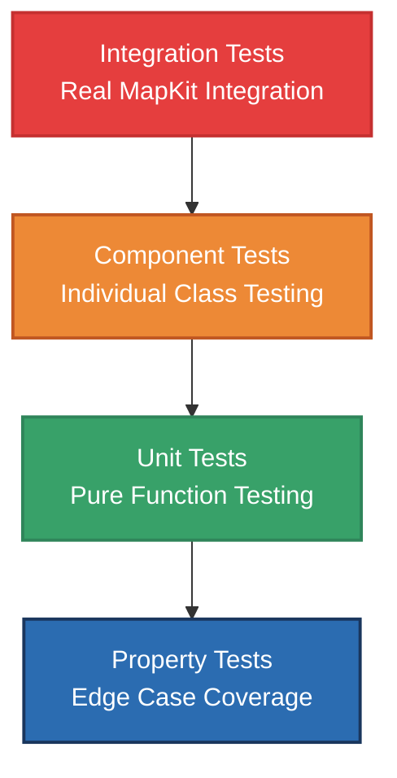

# Testing Strategies and Patterns

## Overview

This document outlines the comprehensive testing strategies used in MapKitSwiftSearch, explaining both the implemented tests and the reasoning behind the testing approach. The testing philosophy emphasizes reliability, maintainability, and real-world scenario coverage.

## Testing Philosophy

### Core Principles

1. **Test Behavior, Not Implementation**: Focus on what the code does, not how it does it
2. **Fast Feedback Loops**: Tests should run quickly to enable frequent execution
3. **Realistic Scenarios**: Tests should reflect actual usage patterns
4. **Regression Prevention**: Critical bugs should have specific tests to prevent reoccurrence
5. **Maintainable Test Code**: Test code should be as clean and well-structured as production code

### Testing Pyramid



## Current Test Implementation

### 1. LocationSearch Integration Tests

The current test suite focuses on end-to-end integration testing with real MapKit services:

```swift
@MainActor
struct LocationSearchTest {
    @Test("Successful search")
    func successfulSearch() async throws {
        let locationSearch = LocationSearch()
        let localSearchCompletions = try await locationSearch.search(queryFragment: "Sheridan, In")

        #expect(!localSearchCompletions.isEmpty, "Expected results")
        let foundLocation = localSearchCompletions.first { $0.title == "Sheridan, IN" }
        #expect(foundLocation != nil, "Didn't find Sheridan")
    }
}
```

**Why This Approach**:
- **Real Data**: Tests against actual MapKit services to catch integration issues
- **End-to-End Validation**: Verifies the complete search flow including networking
- **Realistic Results**: Uses real location data that users would encounter

### 2. Concurrency and Cancellation Tests

Tests verify proper behavior under concurrent access patterns:

```swift
@Test("If a search is in progress, cancel if we get another search request")
func multipleSearches() async throws {
    var cancelCount = 0
    let locationSearch = LocationSearch()

    async let search1: Void = {
        do {
            _ = try await locationSearch.search(queryFragment: "Sheridan, In")
        } catch {
            cancelCount += 1
        }
    }()

    async let search2: Void = {
        do {
            _ = try await locationSearch.search(queryFragment: "Caledonia, Mi")
        } catch {
            // Second search should succeed
        }
    }()

    _ = await (search1, search2)
    #expect(cancelCount == 1, "Expected task1 to cancel")
}
```

**Key Testing Patterns**:
- **Concurrent Execution**: Uses `async let` to test real concurrent scenarios
- **Cancellation Verification**: Confirms that previous searches are properly cancelled
- **Race Condition Prevention**: Validates that the system handles overlapping requests correctly

### 3. Edge Case Coverage

Tests handle boundary conditions and edge cases:

```swift
@Test("Results cleared when searching empty query")
func resultsClearedWhenSearchingEmptyQuery() async throws {
    let locationSearch = LocationSearch()
    var localSearchCompletions = try await locationSearch.search(queryFragment: "Sheridan, In")
    #expect(!localSearchCompletions.isEmpty, "Expected results")

    localSearchCompletions = try await locationSearch.search(queryFragment: "")
    #expect(localSearchCompletions.isEmpty, "Results should be cleared")
}
```

### 4. Validation Logic Tests

Tests verify input validation and error handling:

```swift
@Test("Not searching with less than 5 characters")
func notEnoughCharactersToSearch() async throws {
    let locationSearch = LocationSearch(numberOfCharactersBeforeSearching: 5)

    await #expect(throws: LocationSearchError.invalidSearchCriteria) {
        _ = try await locationSearch.search(queryFragment: "S")
    }
}
```

### 5. Regression Prevention Tests

Specific tests prevent known bugs from reoccurring:

```swift
@Test("Verify highlightedSubTitle uses correct highlight range")
func verifyHighlightedSubTitleUsesCorrectRange() throws {
    // This test verifies that the highlightedSubTitle method uses subtitleHighlightRange
    // rather than titleHighlightRange, which was a bug found during code review
    
    let iosFilePath = "/path/to/LocalSearchCompletion+iOS.swift"
    let macOSFilePath = "/path/to/LocalSearchCompletion+macOS.swift"
    
    // Verify the fix is in place by checking source code
    if let iosContent = try? String(contentsOfFile: iosFilePath, encoding: .utf8) {
        #expect(iosContent.contains("subtitleHighlightRange"), "iOS fix should be present")
    }
}
```

**Why Source Code Testing**:
- **Copy-Paste Error Prevention**: Platform-specific code is prone to copy-paste errors
- **Build-Time Validation**: Catches regressions at build time rather than runtime
- **Documentation**: Test name clearly describes what was fixed

## Advanced Testing Strategies

### 1. Property-Based Testing

Test invariant properties across a wide range of inputs:

```swift
// Example property-based test (not currently implemented)
@Test("Search results maintain ordering consistency")
func searchResultsOrderingProperty() async throws {
    let locationSearch = LocationSearch()
    let queries = generateRandomQueries(count: 100)
    
    for query in queries {
        do {
            let results = try await locationSearch.search(queryFragment: query)
            
            // Property: Results should be consistently ordered
            let secondResults = try await locationSearch.search(queryFragment: query)
            #expect(results.map(\.id) == secondResults.map(\.id), 
                   "Results should be consistently ordered for query: \(query)")
                   
        } catch LocationSearchError.invalidSearchCriteria {
            // Expected for short queries
            continue
        }
    }
}
```

### 2. Performance Testing

Measure and validate performance characteristics:

```swift
// Example performance test (not currently implemented)
@Test("Search performance under load")
func searchPerformanceUnderLoad() async throws {
    let locationSearch = LocationSearch()
    let startTime = CFAbsoluteTimeGetCurrent()
    
    // Simulate rapid user typing
    let queries = ["C", "Co", "Cof", "Coff", "Coffe", "Coffee"]
    
    for query in queries {
        do {
            _ = try await locationSearch.search(queryFragment: query)
        } catch LocationSearchError.invalidSearchCriteria {
            // Expected for short queries
        }
    }
    
    let timeElapsed = CFAbsoluteTimeGetCurrent() - startTime
    #expect(timeElapsed < 5.0, "Search sequence should complete within 5 seconds")
}
```

### 3. Mock-Based Unit Testing

For testing without network dependencies:

```swift
// Example mock-based testing approach (not currently implemented)
protocol LocationSearchProviding {
    func search(queryFragment: String) async throws -> [LocalSearchCompletion]
}

class MockLocationSearch: LocationSearchProviding {
    var mockResults: [LocalSearchCompletion] = []
    var shouldThrowError: LocationSearchError?
    
    func search(queryFragment: String) async throws -> [LocalSearchCompletion] {
        if let error = shouldThrowError {
            throw error
        }
        return mockResults.filter { completion in
            completion.title.contains(queryFragment) || 
            completion.subTitle.contains(queryFragment)
        }
    }
}

@Test("Mock-based search behavior")
func mockBasedSearchBehavior() async throws {
    let mockSearch = MockLocationSearch()
    mockSearch.mockResults = [
        // Create test LocalSearchCompletion instances
    ]
    
    let results = try await mockSearch.search(queryFragment: "test")
    #expect(!results.isEmpty, "Mock should return results")
}
```

## Test Data Management

### 1. Test Location Selection

Current tests use specific, stable locations:

```swift
// Good test locations (used in current tests):
// - "Sheridan, IN" - Small town with consistent results
// - "Caledonia, MI" - Another small town for variety
// - "Pensacola, FL" - Larger city for different result patterns

// Why these locations:
// 1. Stable over time (unlikely to change)
// 2. Unique names (unlikely to have ambiguous results)
// 3. Different geographic regions for variety
// 4. Different population sizes for result diversity
```

### 2. Test Result Validation

Strategies for validating search results:

```swift
// Pattern 1: Exact Match Validation
let foundLocation = localSearchCompletions.first { $0.title == "Sheridan, IN" }
#expect(foundLocation != nil, "Didn't find exact match")

// Pattern 2: Fuzzy Match Validation
let hasExpectedResult = localSearchCompletions.contains { completion in
    completion.title.contains("Sheridan") && completion.subTitle.contains("IN")
}
#expect(hasExpectedResult, "Should find location containing expected terms")

// Pattern 3: Structure Validation
#expect(!localSearchCompletions.isEmpty, "Should return some results")
#expect(localSearchCompletions.count <= 10, "Should limit result count")
```

## Error Testing Strategies

### 1. Comprehensive Error Coverage

Test all error cases systematically:

```swift
@Test("Debounce error handling")
func debounceErrorHandling() async throws {
    let locationSearch = LocationSearch()
    
    let task1 = Task {
        await #expect(throws: LocationSearchError.debounce) {
            _ = try await locationSearch.search(queryFragment: "Pensacola, FL")
        }
    }
    
    let task2 = Task {
        _ = try await locationSearch.search(queryFragment: "Sheridan, In")
    }
    
    await task1.value
    try await task2.value
}
```

### 2. Network Error Simulation

Testing network failure scenarios:

```swift
// Future enhancement: Network condition testing
@Test("Network failure handling")
func networkFailureHandling() async throws {
    // Would require network mocking or simulation
    // This is a placeholder for future implementation
}
```

## Test Organization Patterns

### 1. Nested Test Structures

Current organization uses nested structures for clarity:

```swift
@MainActor
struct LocationSearchTest {
    @MainActor
    struct Search {
        // All search-related tests
    }
    
    @MainActor 
    struct Select {
        // All placemark selection tests
    }
}
```

**Benefits**:
- **Logical Grouping**: Related tests are grouped together
- **Clear Navigation**: Easy to find specific test categories
- **Maintainable**: New tests can be added to appropriate groups

### 2. Test Naming Conventions

Clear, descriptive test names:

```swift
// Good: Describes what and expected outcome
@Test("Successful search")
@Test("If a search is in progress, cancel if we get another search request")
@Test("Results cleared when searching empty query")

// Pattern: [Action] + [Expected Outcome]
// Or: [Condition] + [Expected Behavior]
```

## Testing Anti-Patterns to Avoid

### 1. Over-Mocking

**Problem**: Mocking everything can make tests meaningless
```swift
// Avoid: Testing mock behavior instead of real behavior
let mockCompleter = MockMKLocalSearchCompleter()
mockCompleter.results = [mockResult]
// This tests the mock, not the real integration
```

**Solution**: Use integration tests for critical paths, mocks for specific scenarios

### 2. Brittle Tests

**Problem**: Tests that break with minor changes
```swift
// Avoid: Testing exact result counts or order
#expect(results.count == 5, "Should return exactly 5 results")
// MapKit results can vary over time
```

**Solution**: Test properties that should remain stable

### 3. Test Interdependence

**Problem**: Tests that depend on other tests running first
```swift
// Avoid: Shared state between tests
static var cachedResults: [LocalSearchCompletion] = []
```

**Solution**: Each test should be independent and self-contained

## Future Testing Enhancements

### 1. Automated Performance Regression Detection

```swift
// Benchmark tests to detect performance regressions
@Test("Search latency benchmark")
func searchLatencyBenchmark() async throws {
    let locationSearch = LocationSearch()
    
    measure {
        _ = try await locationSearch.search(queryFragment: "Coffee shops")
    }
}
```

### 2. Chaos Testing

```swift
// Test system behavior under adverse conditions
@Test("Chaos testing - random cancellations")
func chaosTestingRandomCancellations() async throws {
    let locationSearch = LocationSearch()
    
    // Randomly cancel searches to test resilience
    for _ in 0..<50 {
        let task = Task {
            try await locationSearch.search(queryFragment: randomQuery())
        }
        
        if Bool.random() {
            task.cancel()
        }
        
        _ = try? await task.value
    }
}
```

### 3. Contract Testing

```swift
// Verify API contracts are maintained
@Test("API contract validation")
func apiContractValidation() async throws {
    let locationSearch = LocationSearch()
    let results = try await locationSearch.search(queryFragment: "Valid Query")
    
    // Contract: All results must have valid IDs
    for result in results {
        #expect(!result.id.isEmpty, "All results must have non-empty IDs")
        #expect(!result.title.isEmpty, "All results must have non-empty titles")
    }
}
```

## Best Practices Summary

### 1. Test Structure
- Use nested structures for logical organization
- Group related tests together
- Use descriptive, intention-revealing names

### 2. Test Data
- Use stable, real-world locations for integration tests
- Avoid hardcoding specific result counts or orders
- Test with various query lengths and types

### 3. Error Testing
- Test all error conditions explicitly
- Verify proper error propagation
- Test error recovery scenarios

### 4. Concurrency Testing
- Test actual concurrent scenarios
- Verify cancellation behavior
- Test race condition prevention

### 5. Maintenance
- Keep tests simple and focused
- Update tests when behavior intentionally changes
- Remove or update tests for deprecated functionality

This comprehensive testing strategy ensures that MapKitSwiftSearch remains reliable, performant, and maintainable as it evolves. The combination of integration tests, unit tests, and specialized regression tests provides confidence in the package's behavior across a wide range of real-world scenarios.