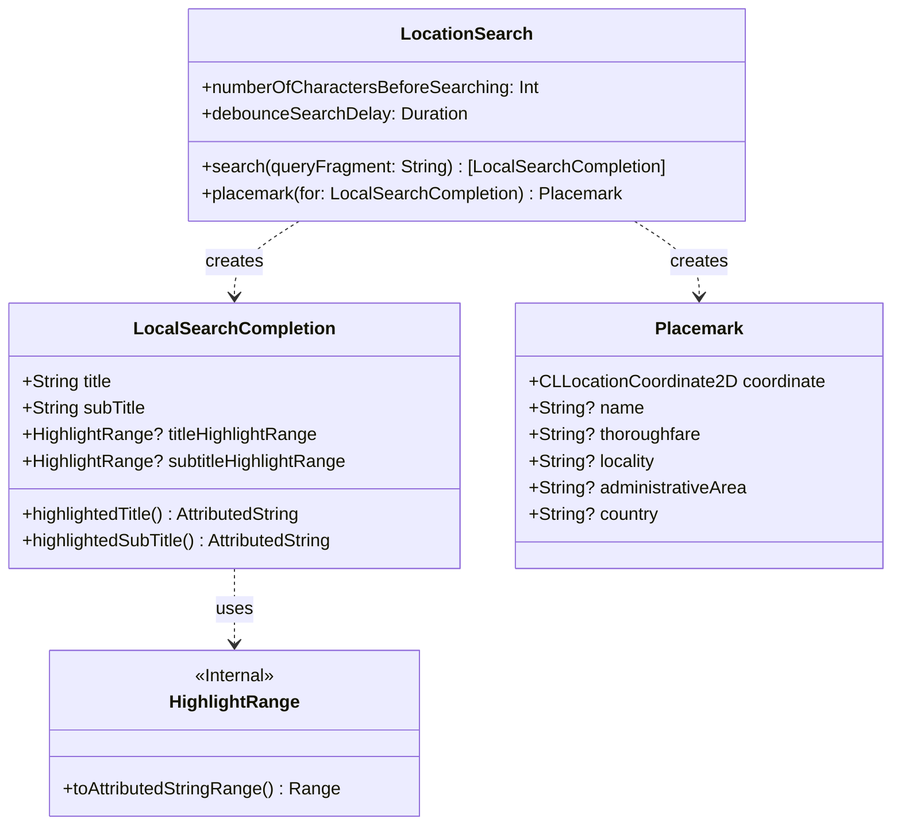
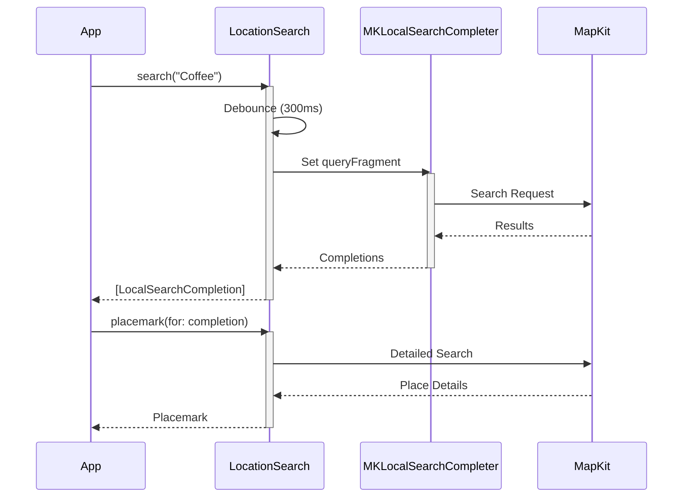

# MapKitSwiftSearch

A Swift-native wrapper around MapKit's location search functionality, providing a modern async/await interface with proper error handling and thread safety.

## Overview

MapKitSwiftSearch provides a safe and idiomatic Swift interface for location search operations using MapKit. While MapKit is powerful, its completion-based APIs can lead to complex callback structures. This library wraps those APIs to provide:

- ✅ Modern Swift concurrency with async/await
- ✅ Type-safe error handling
- ✅ Thread safety through @MainActor attribution
- ✅ Built-in request debouncing
- ✅ Sendable-compliant search results
- ✅ Cross-platform support (iOS and macOS)

## Architecture



## Installation

### Swift Package Manager

Add the following dependency to your `Package.swift`:

```swift
dependencies: [
    .package(url: "https://github.com/kraigspear/MapKitSwiftSearch.git", from: "1.0.0")
]
```

## Usage

### Basic Location Search

```swift
// Create a location search instance
let searcher = LocationSearch()

do {
    // Search for locations
    let results = try await searcher.search(queryFragment: "Coffee shops")
    
    // Process results
    for result in results {
        print("Found: \(result.title) - \(result.subTitle)")
    }
} catch {
    print("Search failed: \(error)")
}
```

### Getting Detailed Location Information

```swift
// Get detailed information for a search result
if let firstResult = results.first {
    if let placemark = try await searcher.placemark(for: firstResult) {
        print("Name: \(placemark.name ?? "")")
        print("Address: \(placemark.thoroughfare ?? "")")
        print("City: \(placemark.locality ?? "")")
        print("Coordinate: \(placemark.coordinate)")
    }
}
```

### Error Handling

```swift
do {
    let results = try await searcher.search(queryFragment: "Co")
} catch LocationSearchError.invalidSearchCriteria {
    // Handle insufficient search text
} catch LocationSearchError.debounce {
    // Handle debounced request
} catch LocationSearchError.mapKitError(let error) {
    // Handle MapKit specific errors
} catch {
    // Handle other errors
}
```

## Search Flow



## Features

### Debouncing
The `LocationSearch` class includes built-in debouncing to prevent excessive API calls. This is particularly useful in search-as-you-type scenarios:

```swift
// Customize debounce delay (default is 300ms)
let searcher = LocationSearch(debounceSearchDelay: .milliseconds(500))
```

### Cross-Platform Text Highlighting
The library provides platform-specific highlighting for search results:

```swift
// iOS
let attributedTitle = searchResult.highlightedTitle(
    foregroundColor: .lightGray,
    highlightColor: .white
)

// macOS
let attributedSubtitle = searchResult.highlightedSubTitle(
    foregroundColor: .lightGray,
    highlightColor: .white
)
```

## Documentation

Comprehensive documentation is available:
- **[DocC Documentation](Sources/MapKitSwiftSearch/Documentation.docc/)** - User guides and API reference
- **[Architecture & Design](docs/Architecture.md)** - Internal design and implementation details
- **[Getting Started Guide](docs/Guides/GettingStarted.md)** - Quick start tutorial
- **[API Reference](docs/Components/)** - Detailed component documentation

## Requirements
- iOS 26.0+ / macOS 26.0+
- Swift 6.2+
- Xcode 16.0+
- Strict Concurrency enabled

## Contributing
Contributions are welcome! Please feel free to submit a Pull Request.

## License
This project is licensed under the MIT License - see the LICENSE file for details.